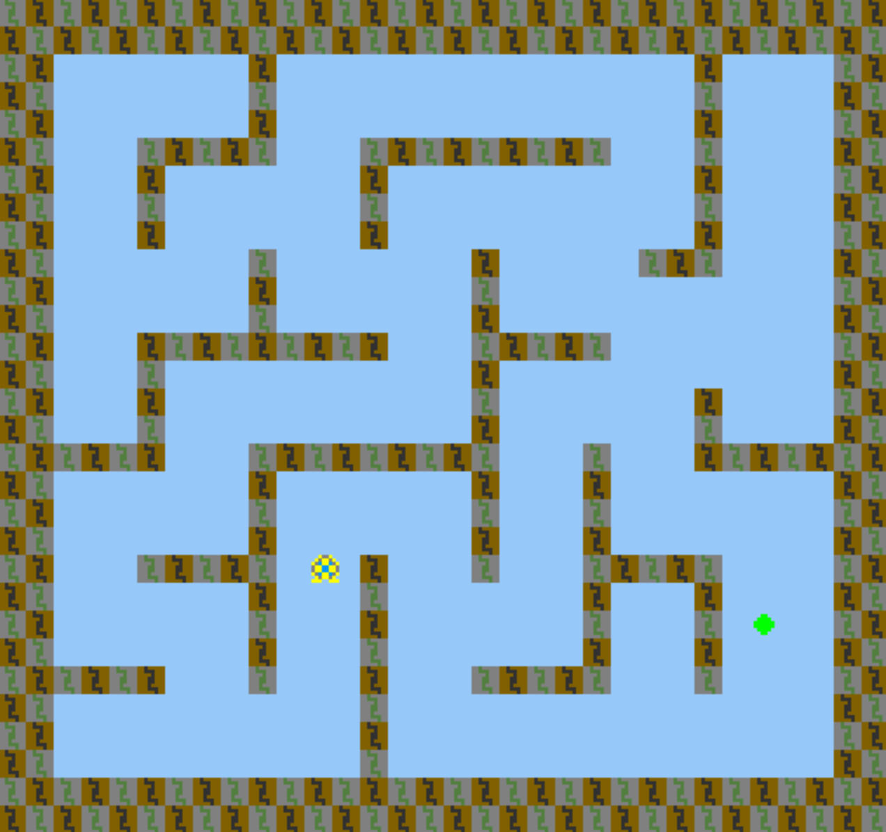

# Maze Teleportation

Author: David Lyons

Design: It's a maze, but the goal changes locations every few seconds. Can you get lucky enough to reach it?

Screen Shot:

How Your Asset Pipeline Works:

For my asset pipeline, since the PPU palette can only be 4 colors, I drew everything in black, red, blue, and green.
Black means transparent. Then red, blue, and green mean take the first, second, and third entries in the palette.
So, rather than actually drawing the right colors image, I made my assets basically instructions on what colors to choose.
For any tiles, I made an 8x8 grid of one of these four choices. Then rather than having to build palettes from images,
I make the palettes and images separately. For palettes, I made a 4x1 color line, starting with black transparent, and convert it.

Originally, I had a one-step asset pipline where in the PlayMode constructor, I load the pngs and have helper routines to convert 
these black/red/green/blue choices into palette indices for the tiles. Then in the draw function, I simply grab a tile and palette.
This worked but was not a "true" asset pipeline, since I didn't have robust runtime code. I thus moved this code into a separate file,
put all of the palettes/tiles/sprites in vectors, and wrote those vectors to a chunk. Then I simply load those chunks in
the PlayMode constructor and write them to the PPU after blanking everything out. In theory, the right way to run this script would
probably be to edit the Maekfile to create an asset_script.exe, but since this script is one-time-only, I simply added
create_assets() to the top of the PlayMode constructor, ran the game once to create the assets, and then removed that line.

You can see the difference between my two techniques by looking at my first and second commit. With the second, I have a "true" asset
pipeline. In theory, to add more assets, you would simply add them to the asset_script. PlayMode, as it should be, is generalized to work
with the size that read_chunk gives it, so it doesn't care how many assets there are.

How To Play:

Left, right, up, down. Anything sky blue can be moved through. The bricks (brown/gray and gray/green) cannot be
crossed. Touching the green goal will win the game. The goal will randomly change locations with a different seed
every game every 3 seconds, with the exception being that the first switch takes 5 seconds. Try to chase it down 
while navigating the maze. If you get lucky, you might get an easy match, but if not, you may be in for a real challenge.
But beware! Don't just sit and wait for it to randomly come to you. If you take more than 30 seconds to reach the goal, you lose!

This game was built with [NEST](NEST.md).

