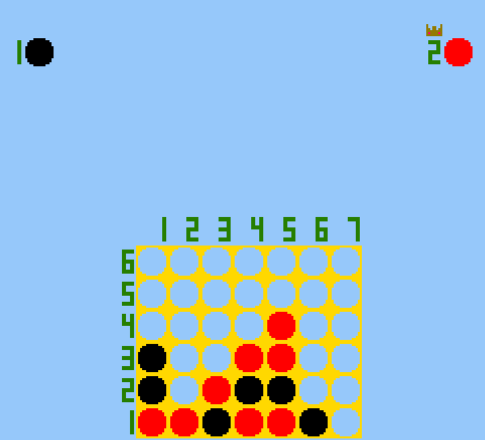

# Connect Four, But Every 10 Seconds the Colors Swap

Author: David Lyons

Screen Shot:

Game Design: For the "Every 10 Seconds" theme, I thought I'd take a classic game but put a twist on it where the game changes every 10 seconds.
My first thought was to have the board rotate and the pieces fall, but from the people I asked, they liked this idea better. This is Connect Four,
but every 10 seconds, the colors swap. Now, there's a lot of strategy. Do you try to connect four? Or do you try to set something up badly, 
knowing that the colors will switch soon? The possibilities are endless!

How to Play: The columns are numbered 1-7. Hit the 1, 2, 3, 4, 5, 6, and 7 keys on the keyboard to place a chip in that column. 
This is a single screen game, so you and your friend will share the keyboard. An arrow at the top will show whose turn it is and which color they have. 
When someone has won the game, the arrow will be replaced with a crown.

Source Code: This game was built with [NEST](NEST.md). The base code is from Carnegie Mellon University 15466 Game Programming assignment 1. 
On top of this base code, I built an asset pipeline that takes 8x8 images I draw and renders them on the screen using PPU446. 
The create_assets() function is commented out, but if you wanted to change how the crown looks or change colors, 
you'd simply make the changes and uncomment that function to rerun the pipeline. I did the entirety of the game-specific programming myself,
and I drew all of the assets by hand in paint.net.

